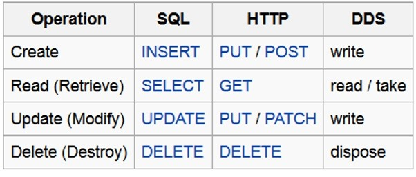
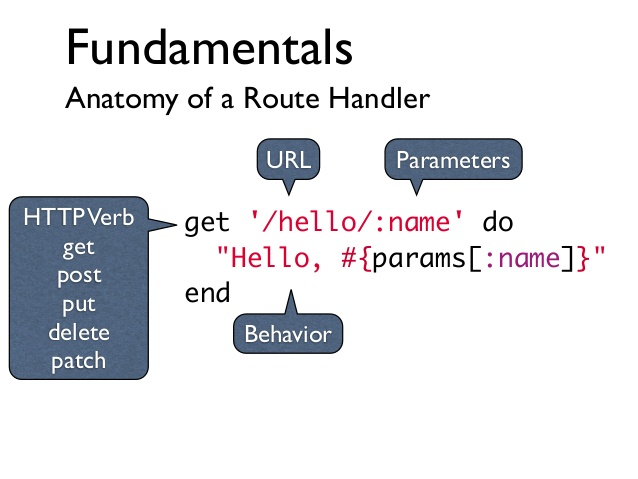

# Intro to Sinatra & MVC

## SWBATs

- [x] Explain the Model View Controller (MVC) pattern and give an example
- [x] Explain how web frameworks (like Sinatra) use the MVC pattern and why
- [x] Define 'convention over configuration'
- [x] Implement one model that inherit from ActiveRecord
- [x] Implement one controller to route and process requests
  - [x] Demonstrate how the params hash changes and where the data comes from
- [x] Implement ERB template and get it to render data from controller and model
- [x] Practice file structure in Sinatra
- [x] Identify the connection between REST and CRUD

## Outline

- How and why we use the MVC pattern
- How CRUD actions map to RESTful Routing
  - Deliverables! Routing!
- Define _"convention over configuration"_
- How Sinatra serves up data in response to web requests
 - Deliverables! Code!

## Words (oh so many words)

### Review

- *TCP* => defines how computers send packets of data to each other
- *HTTP* => defines how messages are formatted and transmitted, and what actions Web servers and browsers should take in response to various commands
- *HTML* => defines the standard markup language for creating web pages and web applications
- *IP* => the principal communications protocol in the Internet protocol suite for relaying datagrams across network boundaries; aka: defines the format of your "internet address"
- *TCP/IP* => See above! It's the how to send + where to send.

### New!

MVC => layer
- *Model*: Mod 1 => class, table
- *Controller*: control everything - handle the communication between the model, view
- *View*: what you see => HTML => rendered version of the HTML

MVC is just one way of writing web application => but this is the one you will be tested on, so remember it.

- *RESTful Routing (REST)*:
  - CRUD maps to HTTP Verbs
  - CREATE => POST
  - READ => GET
  - UPDATE => PATCH/PUT
  - DELETE => DELETE

- REST => REpresentational State Transfer

- *convention over configuration*:
  - convention => a standard => really love standards, protocols, stuff
  - configuration => more customized => there is a time and place for this

## Deliverables

For each deliverable what is the route?

- view information on an individual book
  - READ => GET => READING DATA FROM THE DATABASE!!!
  - /books/:id
    - why id?
      - it's unique
      - based off the database so it has an id
      - SSN => very private => very long, maybe hard to read
      - why not a name? => spacing, spelling => what if the name changes
        - bookmarks break!
        - link rot

- view all books
  - READ => GET <= http verb matters
  - /books

- create a new book
  - 1. create a form...
    - GET
    - /books/new
      - /apple <= custom routing
  - 2. the send the post to create
    - CREATE => POST
    - /books
      - data => parameters => you need a form
    - Resource => URL + Path/Route => Uniform Resource Locator => finding some data
      - that data is our resource
      - www.barnesandnoble.com/books

- edit an existing book
  - different form?
  - Find the book, get the form to edit that book
    - GET
    - /books/:id/edit
  - Edit the book
    - PATCH/PUT
      - which one to use?>?>??
      - difference =>
        - PATCH updates one or more columns
          - the more common one
        - PUT updates everything
    - /books/:id

- delete an existing book
  - find the book to delete
    - GET
    - /books/:id
  - then we delete it
    - DELETE
    - /books/:id

7 restful routes

READ
- all the books => GET /books => Index
- one book => GET /books/:id

CREATE
- GET /books/new
- POST /books

UPDATE
- GET /books/:id/edit
- PATCH/PUT /books/:id

DELETE
- DELETE /books/:id

ribbit => gero
bow wow, bark, woof woof => wan wan
cockadoodledoo => kokekokeko
meow => nyaaaa

## Lecture Notes

### MVC Architecture

In a typical application you will find these three fundamental parts:

* Data \(Model\)

  An interface to view and modify the data

* \(View\)

  Operations that can be performed on the data

* \(Controller\)

The MVC pattern, in a nutshell, is this:

* The model represents the data, and does nothing else. The model does NOT depend on the controller or the view.
* The view displays the data through the controller, and sends user actions \(e.g. button clicks\) to the controller. The view is independent of both the model and the controller.
* The controller provides model data to the view, and interprets user actions such as button clicks. The controller depends on the view and the model.

Rule 1 is the golden rule of MVC:

The model represents the data, and does nothing else. The model does NOT depend on the controller or the view. In other words, _THE MODEL DOES NOT INTERACT WITH THE VIEW, AND THE CONTROLLER DOES ALL THE_ WORK_!_

_Note: an easy analogy to help students with this rule is to think of your MVC app as a restaurant. The model is the food being made in the kitchen, this is the_ meat _of the experience/app. The controller is the restaurant's staff, they handle the experience, prepare the food, and are your first contact if you need anything. The view is you, and your experience. You do not see inside the kitchen, nor do you have visibility on what happens to give you the experience you get. If you want more information, you can always talk to the staff, but they have rules about how much or how little you get to do or see._

* security and access control
* logging
* giving specific users specific content while making views less complex

### CRUD, URLs, and REST

Give an introduction of RESTful Routing and how it connects to CRUD. This diagram will prove helpful:

Talk about how each route specifically maps to a particular resource/model, and can also represent a "method" being passed to that resource's controller. This allows each action on each resource to be unique. Just like CRUD offers both structure and consistency through its rules, REST does the same. Let the students see how `GET`, `PUT`, `POST`/`PATCH`, and `DELETE` map to "Read", "Create", "Update", and "Delete" respectively.

_Note: One thing that helps justify why things are the way they are, is that REST methods try their best to minimize the number of URLs but maximizing functionality. This is why we overload on the same URLs._

It's not necessary that all of this functionality exists, we just choose to expose which things we find important/want our users to be able to do. Reiterate that web requests are stateless, which means that at the default, there is no relationship between any two requests to the server.

Controller:

* Params in requests

  

* Nested erb naming \(with directories\)

View:

* `<%= %>` vs `<% %>`
